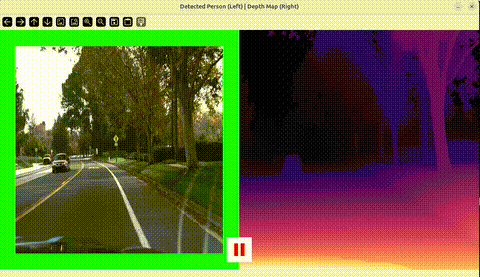

# Close Person Detection

This project detects nearby people in a video stream by combining **object detection** and **depth estimation**.  
It highlights individuals who are closer than a defined distance threshold.

---

## 🎥 Demo Video

The full demonstration video is available to view by clicking on the next GIF:

[](media/demo.webm)

## 📂 Project Structure

```
close_person_detection/
│
├── scripts/
│   ├── main.py
│   ├── viewer.py
│   ├── object_detection.py
│   ├── depth_estimation.py
│   └── close_person_estimation.py
│
└── media/
    └── video.mp4
```

---

## 🚀 Features

- YOLO-based object detection for people.
- MiDaS depth estimation for distance calculation.
- Proximity analysis with alerts (red/orange/green border).
- Real-time visualization combining detection + depth map.

---

## ⚙️ Installation

Follow these steps to install all dependencies and set up the Docker environment:

### 1. Clone the repository
```bash
git clone https://github.com/ANadalCardenas/close_person_detection.git
cd close_person_detection
```

### 2. Build the Docker image
```bash
docker compose build close_person_detection
```

### 3. Run the Docker container
```bash
docker compose up close_person_detection
```

### 4. Access the container shell
```bash
docker exec -it close_person_detection_container bash
```

---

## 🖥️ Requirements

```bash
pip install torch torchvision timm opencv-python numpy
```

---

## ▶️ Usage

1. Place your input video in `close_person_detection/media/video.mp4`.
2. Run the script:

```bash
python scripts/main.py
```

3. Press **'q'** to quit the visualization window.

---

## ⚙️ Configuration

Set the depth limit in `close_person_estimation.py`:

```python
analyzer = ClosePersonAnalyzer(object_name="person", depth_limit=500)
```

---

## 📄 License

MIT License. See the LICENSE file for details.
